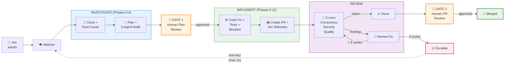

# Issue Fix Agent

An automated issue-fixing system that watches Jira tickets labeled `autofix`
and dispatches AI agents to fix bugs, review code, and manage the full
lifecycle from ticket to merged PR.

> **Runtime:** OpenCode (agent runtime) + OpenShell (sandbox isolation).
> **Model:** Claude Sonnet 4.6 (default). Also supports open models via Ollama/LiteMaaS — see Model Recommendations.
> **Status:** E2E pipeline verified locally and in OpenShell sandbox (7 models evaluated). OpenShift cluster deployment in progress.
> See `docs/Architecture.md` for the full design.

## How It Works



### Step-by-step

1. A user creates a Jira ticket with the `autofix` label and includes the repository URL in the description
2. The **Watcher** (Python, Deployment loop) polls Jira every 20 min (configurable via `JIRA_POLL_INTERVAL`), picks up the ticket, and dispatches the **Investigation Agent** (locally or inside an OpenShell sandbox when deployed on cluster)
3. The **Investigation Agent** clones the repo, investigates the issue, writes a structured fix plan, and optionally runs it through 3 independent audit sub-agents (Architecture, PE, Language Expert) for review
4. After audit approval, the agent posts the plan to Jira and sets `bot-plan-ready` — a **human reviews and approves** the plan
5. After human approval (`bot-plan-approved`), the Watcher dispatches the **Implementation Agent** which implements the fix, runs tests, and creates a PR
6. The **Review Agent** reviews the PR through 3 lenses (correctness, security, quality)
7. If the review finds issues, the **Review-Fix Agent** addresses them and sends back for re-review (max 3 cycles)
8. When the review passes, a human approves and merges the PR
9. The Watcher detects the merge and updates Jira with the `bot-merged` label

## Jira Ticket Format

Add these fields to the ticket description:

```markdown
[Issue description — what's broken, steps to reproduce, expected behavior]

The agent analyzes the description to choose an investigation strategy.
Signals like "was working before" trigger git history analysis; "intermittent"
triggers concurrency analysis. Be descriptive about the problem behavior.

---
## Agent Configuration
**Repository**: https://github.com/org/repo          (REQUIRED)
**Branch**: main                                      (optional)
**Commit**: abc1234def                                (optional — investigate this specific commit)
**Skills**:                                           (optional — multiple guidance URLs)
  - https://raw.githubusercontent.com/org/repo/main/.claude/skills/conventions.md
  - https://raw.githubusercontent.com/org/repo/main/.claude/skills/testing.md
**Knowledge Repo**: https://github.com/org/team-docs  (optional — cloned for context)
```


## Label State Machine

| Label | Meaning |
|-------|---------|
| `autofix` | Permanent marker — ticket should be handled by automation |
| `bot-missing-info` | Ticket missing required info — bot re-checks automatically each cycle |
| `bot-in-progress` | Fix agent is working on it |
| `bot-plan-ready` | Plan approved by auditors, awaiting human review |
| `bot-plan-approved` | Human adds this to authorize implementation (also accepts `bot-proceed`) |
| `bot-ready-for-review` | PR created, awaiting agent review |
| `bot-review-fix` | Review found issues, review-fix agent is addressing them |
| `bot-review-complete` | Agent review passed, awaiting human approval |
| `bot-merged` | PR merged, ticket ready for manual close |
| `bot-fix-failed` | Agent could not fix — needs human attention |
| `no-autofix` | Opt-out — ticket excluded from automation while keeping `autofix` label |
| `bot-retry` | Retry — user adds to `bot-fix-failed` ticket to trigger re-processing (max 2) |
| `bot-cancelled` | Human override — stops active sessions, returns ticket to failed state |

## Project Structure

```
.opencode/
├── agents/           # Agent definitions (fix-investigate, fix-implement, review, review-fix, 3 audit)
├── skills/           # Skill files (issue-investigate, issue-implement, issue-review, review-fix)
├── plugins/          # Safety hooks (block-destructive.js)
└── settings.json     # Pre-allowed permissions for unattended agents
orchestrator/
├── watcher.py        # Jira polling, label state machine, 9 phases
├── dispatcher.py     # Agent dispatch with OpenShell sandbox support
├── jira_client.py    # REST API client for Jira (v3 ADF parsing)
├── config.py         # Config from env vars + projects.json
└── models.py         # Data models (Ticket, CycleStats)
policies/             # OpenShell sandbox policies (filesystem + network)
manifests/            # K8s manifests (namespace, RBAC, PVC, secrets, deployment)
local-docs/           # Setup guides, learnings, model evaluation (not committed to upstream)
docs/
├── Architecture.md   # System design and deployment
└── ...               # Analysis, plans, testing
Containerfile         # UBI9 image with OpenCode, OpenShell, toolchain
opencode.json         # OpenCode config — MCP servers, instructions
AGENTS.md             # Project rules loaded into agent context
```

## Quick Start — Fix a Bug Locally

### 1. Prerequisites

```bash
# OpenCode (AI agent runtime)
npm i -g opencode                        # or: curl -fsSL https://opencode.ai/install.sh | sh
opencode --version                       # v1.17.11+

# GitHub CLI (for PR creation)
gh auth status                           # must be authenticated

# Python deps (for watcher, optional)
uv pip install -r orchestrator/requirements.txt   # or: pip install -r orchestrator/requirements.txt

# Jira MCP server (for Jira integration)
pip install mcp-atlassian                # or: uvx mcp-atlassian
```

### 2. Set Credentials

Create a `.env` file in the project root (already gitignored):

```bash
JIRA_USERNAME=your@email.com
JIRA_API_TOKEN=your-jira-api-token       # https://id.atlassian.com/manage-profile/security/api-tokens
GITHUB_TOKEN=your-github-pat             # or: gh auth token
```

### 3. Choose a Model

```bash
# Option A: Vertex AI (recommended — highest reliability)
# Requires: gcloud auth, GOOGLE_CLOUD_PROJECT env var
export CLAUDE_CODE_USE_VERTEX=1
export ANTHROPIC_VERTEX_PROJECT_ID=your-gcp-project
MODEL="google-vertex-anthropic/claude-sonnet-4-6@default"

# Option B: Local Ollama (free, works offline)
ollama serve &
ollama pull deepseek-r1:32b              # or: gemma4:31b
MODEL="ollama/deepseek-r1:32b"

# Option C: LiteMaaS (Red Hat internal shared gateway)
# Edit .opencode/opencode.json with your LiteMaaS API key
MODEL="litemaas/Qwen3.6-35B-A3B"
```

### 4. Create a Jira Ticket

Add the `autofix` label and include the Agent Configuration in the description:

```markdown
[Describe the bug — what's broken, steps to reproduce, expected behavior]

## Agent Configuration
**Repository**: https://github.com/your-org/your-repo
**Branch**: main
```

### 5. Run the Agent

**Option A — Single issue (manual, no watcher):**

```bash
# Source credentials
set -a && source .env && set +a

# Step 1: Investigate — produces a fix plan
opencode run --agent fix-investigate \
  --dangerously-skip-permissions \
  -m $MODEL \
  "Investigate Jira ticket YOUR-TICKET-KEY. Follow the skill."

# Review the plan on GitHub (.autofix/<PROJECT>/<TICKET>/fix-plan.md)
# Then swap label: bot-plan-ready → bot-in-progress

# Step 2: Implement — creates a PR
opencode run --agent fix-implement \
  --dangerously-skip-permissions \
  -m $MODEL \
  "Implement the approved fix for YOUR-TICKET-KEY. Follow the skill."

# Agent creates PR, updates Jira, swaps label to bot-ready-for-review
```

**Option B — Watcher (automated, polls Jira):**

```bash
set -a && source .env && set +a

# Dry run first (no mutations)
python -m orchestrator.watcher --dry-run

# Single cycle (processes all autofix tickets once)
python -m orchestrator.watcher

# Continuous loop (polls every 20 min, SIGTERM to stop)
python -m orchestrator.watcher --loop
```

### 6. What Happens Next

```
Investigate → Plan pushed to branch → HUMAN reviews plan → Implement →
PR created → Review Agent (3-lens) → Review-Fix (max 3 cycles) →
HUMAN approves PR → Merged
```

The agent updates Jira labels at each step. Check the Label State Machine
below for details.

### Notes

- `--dangerously-skip-permissions` is for local/eval runs only — skips
  interactive permission prompts. Do not use in production.
- For non-interactive runs (CI, scripts), wrap with `script -q <logfile>`
  to provide a PTY.
- Clean up cloned repos after runs: `rm -rf target-repo/`

## Quick Start — OpenShell Sandbox (Local)

Run agents inside an OpenShell sandbox for production-like isolation
(Landlock filesystem, seccomp syscall filtering, network policy enforcement).
Works on macOS via Docker Desktop / Podman.

### 1. Prerequisites

```bash
# OpenShell CLI
openshell --version                      # v0.0.71+

# Container runtime (Podman or Docker Desktop)
podman machine list                      # or: docker info

# Local OpenShell gateway
openshell status                         # should show "Connected"

# If gateway not running:
openshell gateway add http://127.0.0.1:17670 --local
```

If `openshell sandbox create` fails with "network not found" (Podman only):
```bash
podman network create openshell-docker   # one-time setup, not needed for Docker Desktop
```

### 2. Sandbox Policy

The repo includes pre-configured restrictive policies in `policies/`:

- `fix-investigate.yaml` — for investigation agent
- `fix-implement.yaml` — for implementation agent
- `review.yaml` / `review-fix.yaml` — for review agents

Each policy enforces:
- **Filesystem**: Landlock-restricted (read-only `/usr`, `/lib`, `/etc`; write only `/sandbox`, `/tmp`)
- **Network**: Only allowed endpoints (GitHub, Jira, Vertex AI, LiteMaaS) — all other outbound blocked

For **local Ollama** models, add the Ollama endpoint to the policy:

```yaml
# Append to network_policies section in policies/fix-investigate.yaml:
  ollama:
    endpoints:
      - host: host.docker.internal
        port: 11434
        protocol: rest
        access: full
    binaries:
      - path: /**
```

For **Vertex AI**, the policy already includes `us-east5-aiplatform.googleapis.com`.
You must also add `oauth2.googleapis.com` for Application Default Credentials
(required for token refresh):

```yaml
# Append under vertex_ai endpoints in policies/fix-investigate.yaml:
      - host: oauth2.googleapis.com
        port: 443
        protocol: rest
        access: full
```

> **Note:** Uploaded gcloud credentials land at `~/gcloud/` inside the sandbox
> (HOME=/sandbox). The Vertex AI example command creates a symlink to
> `~/.config/gcloud/` for SDK discovery.

### 3. Run in Sandbox

**With Vertex AI (Opus/Sonnet):**

```bash
# Requires gcloud Application Default Credentials
openshell sandbox create --name fix-run \
  --policy policies/fix-investigate.yaml \
  --upload .opencode \
  --upload opencode.json \
  --upload AGENTS.md \
  --upload ~/.config/gcloud \
  --env "JIRA_USERNAME=$JIRA_USERNAME" \
  --env "JIRA_API_TOKEN=$JIRA_API_TOKEN" \
  --env "GITHUB_TOKEN=$GITHUB_TOKEN" \
  --env "JIRA_URL=https://your-jira.atlassian.net" \
  --env "CLAUDE_CODE_USE_VERTEX=1" \
  --env "ANTHROPIC_VERTEX_PROJECT_ID=your-gcp-project" \
  --env "GOOGLE_CLOUD_PROJECT=your-gcp-project" \
  --env "CLOUD_ML_REGION=us-east5" \
  --env "GOOGLE_APPLICATION_CREDENTIALS=/sandbox/gcloud/application_default_credentials.json" \
  --no-keep \
  -- bash -c '
    mkdir -p ~/.config && ln -s ~/gcloud ~/.config/gcloud
    opencode run --agent fix-investigate \
      -m google-vertex-anthropic/claude-sonnet-4-6@default \
      "Investigate Jira ticket YOUR-TICKET. Follow the skill."
  '
```

**With Ollama (local models):**

```bash
openshell sandbox create --name fix-run \
  --policy policies/fix-investigate.yaml \
  --upload .opencode \
  --upload opencode.json \
  --upload AGENTS.md \
  --env "JIRA_USERNAME=$JIRA_USERNAME" \
  --env "JIRA_API_TOKEN=$JIRA_API_TOKEN" \
  --env "GITHUB_TOKEN=$GITHUB_TOKEN" \
  --env "JIRA_URL=https://your-jira.atlassian.net" \
  --no-keep \
  -- opencode run --agent fix-investigate \
    -m ollama/deepseek-r1:32b \
    "Investigate Jira ticket YOUR-TICKET. Follow the skill."
```

> **Note:** Open models (DeepSeek, Gemma4) have limited reliability in the
> sandbox — same as local runs. See Model Recommendations for pass rates.

> **Note:** The sandbox OpenCode version (v1.2.18) differs from the local
> install (v1.17.11). Core `run` functionality works but some flags like
> `--dangerously-skip-permissions` are not available — the sandbox handles
> permissions via policy instead.

### 4. Key Differences from Local Runs

| Aspect | Local (`opencode run`) | Sandbox (`openshell sandbox create`) |
|--------|----------------------|--------------------------------------|
| Filesystem | Full host access | Landlock-restricted (workdir + /tmp) |
| Network | Unrestricted | Policy-controlled (only allowed hosts) |
| Permissions | `--dangerously-skip-permissions` | Sandbox policy enforces |
| Ollama URL | `localhost:11434` | `host.docker.internal:11434` |
| gcloud creds | `~/.config/gcloud/` auto-discovered | Must upload + set `GOOGLE_APPLICATION_CREDENTIALS` |
| Cleanup | Manual (`rm -rf target-repo/`) | Automatic (`--no-keep`) |

## Local Development

> Full guide: `local-docs/local-development-guide.md`

### Model Recommendations

Agent definitions default to `google-vertex-anthropic/claude-sonnet-4-6` but
you can override at runtime with `-m`. The pipeline requires strong
instruction-following and multi-step tool execution — not all models can
reliably complete the full 11-phase workflow.

| Provider | Model ID | Notes |
|----------|----------|-------|
| Vertex AI | `google-vertex-anthropic/claude-sonnet-4-6` | Recommended default — handles all issue types |
| Vertex AI | `google-vertex-anthropic/claude-opus-4-6` | For complex or high-priority issues |
| Ollama | `ollama/deepseek-r1:32b` | Fast local option — works for simple, well-scoped bugs |
| Ollama Cloud | `ollama/minimax-m2.5:cloud` | Cloud-hosted open model — works for simple bugs |
| LiteMaaS | `litemaas/Qwen3.6-35B-A3B` | Cluster-compatible — can investigate but struggles with implementation |
| Ollama | `ollama/gemma4:31b` | Local testing only — slow inference, limited reliability |
| Ollama | `ollama/qwen3-coder-fixed` | Not recommended — poor instruction following |

> **Note:** Open models (30-35B) can often identify root causes correctly but
> struggle with the multi-phase implementation pipeline. The bottleneck is
> instruction following and tool-call reliability, not reasoning capability.
> Run your own eval with `eval/run-eval.sh` to benchmark models on your issues.

## OpenShift + OpenShell Cluster Deployment

> **Status:** Full watcher + OpenShell pipeline validated on OpenShift 4.21.
> Watcher polls Jira, dispatches agents in OpenShell sandboxes on cluster.
> Infrastructure E2E verified (Qwen 3.6 via LiteMaaS — investigation runs,
> implementation needs stronger model). Local OpenShell sandbox E2E verified
> with Claude Opus (investigate + implement + PR creation).
>
> Full guide: `local-docs/setup-openshift-cluster.md` (step-by-step, 400+ lines)

### 1. Build and Push Image

```bash
# Always build for linux/amd64 (even from Apple Silicon)
podman build --no-cache --platform linux/amd64 \
  -t quay.io/rzalavad/issue-fix-agent:latest -f Containerfile .
podman push quay.io/rzalavad/issue-fix-agent:latest
```

### 2. Install OpenShell on Cluster

```bash
# Agent Sandbox CRD
oc apply -f https://github.com/kubernetes-sigs/agent-sandbox/releases/latest/download/manifest.yaml

# OpenShell gateway via Helm
oc create namespace openshell
helm upgrade --install openshell \
  oci://ghcr.io/nvidia/openshell/helm-chart \
  --version 0.0.62 \
  --namespace openshell \
  --set server.auth.allowUnauthenticatedUsers=true

# Grant SCCs (required for Landlock/seccomp)
oc adm policy add-scc-to-user anyuid -z openshell -n openshell
oc adm policy add-scc-to-user anyuid -z default -n openshell
oc adm policy add-scc-to-user privileged -z openshell-sandbox -n openshell

# Verify gateway
oc get pods -n openshell                 # should show openshell-0 Running
```

### 3. Deploy Watcher

```bash
# Namespace, RBAC, storage
oc apply -f manifests/namespace.yaml
oc apply -f manifests/rbac.yaml
oc apply -f manifests/pvc.yaml

# Secrets (replace with your values — do NOT use secrets.yaml template)
oc create secret generic watcher-secrets \
  --from-literal=GITHUB_TOKEN="$GITHUB_TOKEN" \
  --from-literal=JIRA_USERNAME="$JIRA_USERNAME" \
  --from-literal=JIRA_API_TOKEN="$JIRA_API_TOKEN" \
  -n issue-fix-agent

oc create secret generic litemaas-config \
  --from-literal=opencode.json='<your LiteMaaS opencode.json>' \
  -n issue-fix-agent

# Config (review configmap.yaml — start with DRY_RUN=true)
oc apply -f manifests/configmap.yaml

# Copy OpenShell TLS certs to watcher namespace
oc get secret openshell-client-tls -n openshell -o json | \
  python3 -c "import sys,json; d=json.load(sys.stdin); \
  d['metadata']={'name':'openshell-client-tls','namespace':'issue-fix-agent'}; \
  print(json.dumps(d))" | oc apply -n issue-fix-agent -f -

# Deploy
oc apply -f manifests/deployment.yaml

# Verify
oc logs deploy/issue-fix-watcher -n issue-fix-agent
# Should show: "Watcher starting in loop mode"
```

### 4. Verify and Go Live

```bash
# Check DRY_RUN mode works (should show Jira polling without mutations)
oc logs -f deploy/issue-fix-watcher -n issue-fix-agent

# Switch to live mode (edit configmap: DRY_RUN=false)
oc apply -f manifests/configmap.yaml
oc rollout restart deploy/issue-fix-watcher -n issue-fix-agent

# Apply network hardening
oc apply -f manifests/networkpolicy.yaml
oc apply -f manifests/resourcequota.yaml
```

### Deploy Order (Important)

```
1. OpenShell (gateway must exist before watcher starts — TLS secret dependency)
2. Namespace + RBAC + PVC
3. Secrets (watcher-secrets + litemaas-config)
4. ConfigMap (start with DRY_RUN=true)
5. Copy TLS secret from openshell → issue-fix-agent namespace
6. Deployment
7. Verify → switch DRY_RUN=false
8. NetworkPolicy + ResourceQuota
```

### Cluster Model Note

The configmap defaults to `litemaas/Qwen3.6-35B-A3B` (the only model
available on cluster via LiteMaaS). Per eval results:
- **Investigation**: works (4/6 correct root cause identification)
- **Implementation**: fails (0/6 — instruction following insufficient)

For full E2E on cluster, configure Vertex AI with a GCP service account,
or wait for a stronger open model on LiteMaaS.

### Credentials

| Credential | Where | Stored as |
|------------|-------|-----------|
| GitHub token | Local: `$GITHUB_TOKEN` env var | Cluster: K8s Secret `watcher-secrets` |
| Jira API token | Local: `$JIRA_API_TOKEN` env var | Cluster: K8s Secret `watcher-secrets` |
| LiteMaaS API key | Local: `.opencode/opencode.json` | Cluster: K8s Secret `litemaas-config` |

## Documentation

| Doc | Purpose |
|-----|---------|
| `docs/Architecture.md` | System design, label state machine, audit loop |
| `local-docs/local-development-guide.md` | Detailed local setup, provider config, model selection |
| `local-docs/setup-openshift-cluster.md` | Step-by-step cluster deployment (40 issues documented) |
| `eval/README.md` | Model evaluation results and benchmarking scripts |
| `local-docs/demo-token-savings.md` | Token optimization layers (RTK, Ponytail, model routing) |
| `local-docs/learnings.md` | 40 lessons from development and deployment |

## Inspired By

Initial skill patterns inspired by the [AAP SDLC Harness](https://gitlab.cee.redhat.com/aap-sdlc/harness)
(bugfix-workflow, code-review, git-workflow, jira-integration, ai-attribution).
Skills have since been rewritten for OpenCode with structured playbooks,
audit sub-agents, and MCP-based Jira integration.
