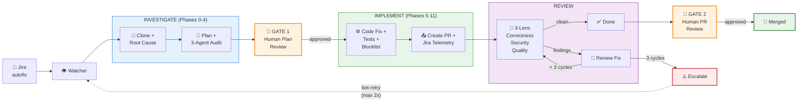

# Issue Fix Agent

An automated issue-fixing system that watches Jira tickets labeled `autofix`
and dispatches AI agents to fix bugs, review code, and manage the full
lifecycle from ticket to merged PR.

> **Runtime:** OpenCode (agent runtime) + OpenShell (sandbox isolation).
> **Model:** Claude Sonnet 4.6 (default). Also supports open models via Ollama/LiteMaaS.
> **Status:** E2E verified locally, in OpenShell sandbox, and on OpenShift 4.21 cluster.

## How It Works



### Step-by-step

1. A user creates a Jira ticket with the `autofix` label and includes the repository URL
2. The **Watcher** polls Jira, picks up the ticket, dispatches the **Investigation Agent**
3. The **Investigation Agent** clones the repo, investigates, writes a fix plan, runs 3 audit sub-agents
4. A **human reviews and approves** the plan
5. The **Implementation Agent** implements the fix, runs tests, creates a PR
6. The **Review Agent** reviews the PR (correctness, security, quality)
7. The **Review-Fix Agent** addresses findings (max 3 cycles)
8. A **human approves and merges** the PR

## Getting Started

| Guide | Description |
|-------|-------------|
| **[Local Quick Start](docs/quickstart-local.md)** | Run agents on your Mac with `opencode run` — no sandbox |
| **[OpenShell Sandbox](docs/quickstart-openshell.md)** | Run agents in OpenShell sandbox locally — Landlock isolation via Podman |
| **[OpenShift Deployment](docs/deploy-openshift.md)** | Full cluster deployment — watcher + OpenShell + Helm |

## Jira Ticket Format

```markdown
[Describe the bug — what's broken, steps to reproduce, expected behavior]

## Agent Configuration
**Repository**: https://github.com/org/repo          (REQUIRED)
**Branch**: main                                      (optional)
**Commit**: abc1234def                                (optional)
**Skills**:                                           (optional)
  - https://raw.githubusercontent.com/org/repo/main/.claude/skills/conventions.md
**Knowledge Repo**: https://github.com/org/team-docs  (optional)
```

## Label State Machine

| Label | Meaning |
|-------|---------|
| `autofix` | Permanent marker — ticket should be handled by automation |
| `bot-in-progress` | Fix agent is working on it |
| `bot-plan-ready` | Plan approved by auditors, awaiting human review |
| `bot-plan-approved` | Human adds this to authorize implementation (also accepts `bot-proceed`) |
| `bot-ready-for-review` | PR created, awaiting agent review |
| `bot-review-fix` | Review found issues, review-fix agent is addressing them |
| `bot-review-complete` | Agent review passed, awaiting human approval |
| `bot-merged` | PR merged, ticket ready for manual close |
| `bot-fix-failed` | Agent could not fix — needs human attention |
| `bot-missing-info` | Ticket missing required info — bot re-checks each cycle |
| `bot-retry` | Retry — user adds to `bot-fix-failed` ticket to trigger re-processing (max 2) |
| `bot-cancelled` | Human override — stops active sessions, returns ticket to failed state |
| `no-autofix` | Opt-out — ticket excluded from automation |

## Configuration

| Variable | Default | Description |
|----------|---------|-------------|
| `PLAN_IN_PR` | `true` | `true`: plan committed to branch + PR as audit trail. `false`: plan posted in Jira comment only, not in PR. |
| `JIRA_POLL_INTERVAL` | `20` | Minutes between watcher polling cycles |
| `MAX_FIX_RETRIES` | `2` | Max retry attempts when human adds `bot-retry` |
| `REVIEW_FIX_MAX_CYCLES` | `3` | Max review-fix iterations before escalation |
| `AUDIT_ENABLED` | `true` | Enable 3-agent audit loop for fix plans |
| `DRY_RUN` | `false` | Watcher polls Jira but makes no mutations |
| `SANDBOX_ENABLED` | `false` | Dispatch agents in OpenShell sandboxes |

Full config reference: [docs/Architecture.md](docs/Architecture.md) → config.env section.

## Model Recommendations

| Provider | Model ID | Notes |
|----------|----------|-------|
| Vertex AI | `google-vertex-anthropic/claude-sonnet-4-6` | Recommended default — handles all issue types |
| Vertex AI | `google-vertex-anthropic/claude-opus-4-6` | For complex or high-priority issues |
| Ollama | `ollama/deepseek-r1:32b` | Fast local option — works for simple, well-scoped bugs |
| Ollama Cloud | `ollama/minimax-m2.5:cloud` | Cloud-hosted open model — works for simple bugs |
| LiteMaaS | `litemaas/Qwen3.6-35B-A3B` | Cluster-compatible — can investigate but struggles with implementation |
| Ollama | `ollama/gemma4:31b` | Local testing only — slow inference, limited reliability |

> **Note:** Open models (30-35B) can often identify root causes correctly but
> struggle with the multi-phase implementation pipeline. The bottleneck is
> instruction following and tool-call reliability, not reasoning capability.

## Project Structure

```
.opencode/
├── agents/           # Agent definitions (fix-investigate, fix-implement, review, review-fix, 3 audit)
├── skills/           # Skill files (issue-investigate, issue-implement, issue-review, review-fix)
├── plugins/          # Safety hooks (block-destructive.js)
└── settings.json     # Pre-allowed permissions for unattended agents
orchestrator/
├── watcher.py        # Jira polling, label state machine, 9 phases
├── dispatcher.py     # Agent dispatch with OpenShell sandbox support
├── jira_client.py    # REST API client for Jira (v3 ADF parsing)
├── config.py         # Config from env vars + projects.json
└── models.py         # Data models (Ticket, CycleStats)
policies/             # OpenShell sandbox policies (filesystem + network)
manifests/            # K8s manifests (namespace, RBAC, PVC, secrets, deployment)
docs/                 # Deployment guides and architecture
eval/                 # Model evaluation results
Containerfile         # UBI9 image with OpenCode, OpenShell, toolchain
opencode.json         # OpenCode config — MCP servers, instructions
AGENTS.md             # Project rules loaded into agent context
```

## Documentation

| Doc | Purpose |
|-----|---------|
| [docs/quickstart-local.md](docs/quickstart-local.md) | Local development — `opencode run` on your Mac |
| [docs/quickstart-openshell.md](docs/quickstart-openshell.md) | OpenShell sandbox — local Podman isolation |
| [docs/deploy-openshift.md](docs/deploy-openshift.md) | OpenShift cluster deployment + OpenShell |
| [docs/Architecture.md](docs/Architecture.md) | System design, label state machine, audit loop |
| [eval/README.md](eval/README.md) | Model evaluation results and benchmarking |
| [CONTRIBUTING.md](CONTRIBUTING.md) | How to contribute — code standards, workflow, review process |

## Inspired By

Initial skill patterns inspired by the [AAP SDLC Harness](https://gitlab.cee.redhat.com/aap-sdlc/harness)
(bugfix-workflow, code-review, git-workflow, jira-integration, ai-attribution).
Skills have since been rewritten for OpenCode with structured playbooks,
audit sub-agents, and MCP-based Jira integration.
